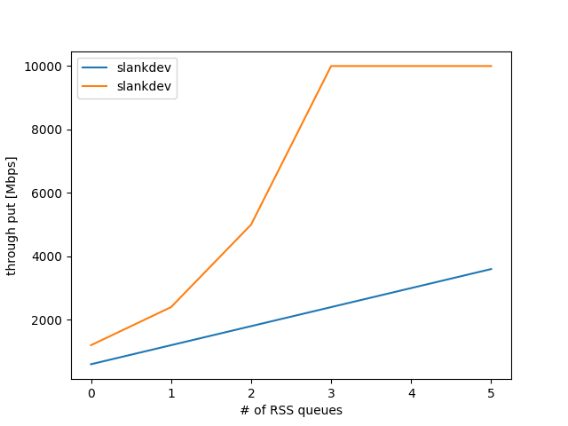

性能評価
=========

Delay関数の評価
----------------

性能計測はpktgen-dpdkを用いてブラックボックス性能テストを行うと前節では述べた.
では, 実際にpktgenを用いて計測した値に対してどの程度の信頼性があるのかを
計算する方法を整理する.

- 64Byteパケットで10Gbps Wirerateを出す場合は14Mppsになる.
- 14Mppsを出すには1パケットを67nsで処理する必要がある
- 動作周波数が2GHzのCPUの場合

  - 14Mpps の処理性能は 134clock/packet
  - 140Mpps の処理性能は 13clock/packet

このようにDPDK-VNFの性能計測は結構見積もれそうな気がしてきたので,
もう少ししっかりと考えてみよう. 多くのDPDKアプリケーションの場合,
パケット解析のプログラムの流れは以下のようになる.

.. code-block:: c

  size_t n_rx = rte_eth_rx_burst (0, 0, pkts, 32);
  for (size_t i=0; i<n_rx; i++)
    {
      process_packet (pkts[i])
      size_t n_tx = rte_eth_tx_burst (1, 0, &pkts[i], 1);
      if (n_tx != 1)
        rte_pktmbuf_free (pkts[i]);
    }

1行目に32burstで受信処理をおこない, 4行目でパケット処理をおこない, 5行目で
パケットの送信を行なっている. 今回は都合上, tx_buffer等の
bulk transmissionを利用して実装を行なったとする.

この時の性能に影響を与える部分は以下の3つに分けられる.

- 32 bulk rx
- packet process
- 1 tx buffering

今回はpacket processの部分にdelayを挿入して性能計測を行なっていくわけだが,
32 bulk rxと, 1tx bufferingでどの程度の計算機的コストを払っているかを
明らかにしなくては, 本来の性能計測の見積もりができそうにない.

なので, 今回はTxBufferの実験を用いて, rx/txのコストを計測していく.
基本的に計測対象は以下のようにして計測を行う.

.. code-block:: c

  static size_t sum = 0;
  static size_t cnt = 0;
  size_t before = rte_get_tsc_cycles ()
  //検査対象コード
  sum += rte_get_tsc_cycles () - before;
  cnt ++;
  if (cnt > 10000000)
  {
    printf ("latency: %zd \n", sum / cnt);
    cnt = sum = 0;
  }

このようにしてrdtscを用いてプログラムの実行速度を細かく測っていく.

Delayの準備
^^^^^^^^^^^^^^^^

DPDKには ``rte_delay_ms()`` , ``rte_delay_us_block()`` といったdelayを作り出す
関数が存在している. 性能計測等の目的で使用することが想定されているようなので,
正確なdelayを挿入することができるとてもありがたい関数である一方で,
10GbE以上の性能計測を行う場合においては, より細かい制度でのdelayを挿入したい.

本節では, 性能計測を行う上で用いるdelayの方法に関しての整理と, それらを用いた
数理的な性能見積もりに関して論ずる.

rte_delay_us関数
^^^^^^^^^^^^^^^^

DPDKに用意されているdelayの関数であるため, 信頼性がたかい(と筆者は思っている)
rdtscによる遅延計測でも安定した値を出していた.

空ループdelay
^^^^^^^^^^^^^^^^

nano secオーダのdelayが欲しかったが, さすがにCPUのクロック周波数が2GHz程度では,
その細かさの正確なdelayは作れなかったので, 10nsオーダのなんとなく正しいdelay
関数を無理やり実装した. この方法は完全なdirty-hackなため推奨されるべきものではない.
以下に実装を示す.

.. code-block:: none

  static inline void
  dirty_looped_delay_10ns (uint32_t nsec)
  {
    volatile uint32_t vcount = nsec*8 + nsec;
    while (vcount --);
  }

筆者の環境ではなんとかこれでそれっぽい精度で動いている.
ベンチマーク結果は後述する.

性能評価
^^^^^^^^^^^

delayの検証用プログラムを以下に示す.

.. code-block:: c

  #include <stdio.h>
  #include <rte_launch.h>
  #include <rte_eal.h>
  #include <rte_lcore.h>
  #include <rte_cycles.h>
  #define MEGA (1000 * 1000)
  #define GIGA (1000 * 1000 * 1000)

  static inline void
  dirty_looped_delay_10ns (uint32_t nsec)
  {
    volatile uint32_t vcount = nsec*8 + nsec;
    while (vcount --);
  }

  static void
  test_dirty_looped_delay_10ns (size_t nsec, size_t trycnt)
  {
    size_t sum = 0;
    for (size_t i=0; i<trycnt; i++)
      {
        size_t before = rte_get_tsc_cycles ();
        dirty_looped_delay_10ns (nsec);
        sum += rte_get_tsc_cycles () - before;
      }
    size_t latency = sum/trycnt;
    size_t hz = rte_get_tsc_hz ();
    printf ("dirty_looped_delay_10ns(%zd): "
            " lat=%zd [clk] try=%zd, delay=%zdns\n",
            nsec, latency, trycnt, GIGA*latency/hz);
  }

  static void
  test_rte_delay_us_block (size_t usec, size_t trycnt)
  {
    size_t sum = 0;
    for (size_t i=0; i<trycnt; i++)
      {
        size_t before = rte_get_tsc_cycles ();
        rte_delay_us_block (usec);
        sum += rte_get_tsc_cycles () - before;
      }
    size_t latency = sum/trycnt;
    size_t hz = rte_get_tsc_hz ();
    printf ("rte_delay_us_block(%zd): "
            " lat=%zd [clk] try=%zd, delay=%zdus\n",
            usec, latency, trycnt, MEGA*latency/hz);
  }

  static int
  func (__attribute__((unused)) void *arg)
  {
    printf ("freq: %zd\n", rte_get_tsc_hz ());
    size_t trycnt = MEGA;
    test_rte_delay_us_block (1, trycnt);
    test_rte_delay_us_block (2, trycnt);
    test_rte_delay_us_block (3, trycnt);
    test_rte_delay_us_block (4, trycnt);
    trycnt = 100 * MEGA;
    test_dirty_looped_delay_10ns (1, trycnt);
    test_dirty_looped_delay_10ns (2, trycnt);
    test_dirty_looped_delay_10ns (3, trycnt);
    test_dirty_looped_delay_10ns (4, trycnt);
    return 0;
  }

  int
  main (int argc, char **argv)
  {
    rte_log_set_global_level (RTE_LOG_EMERG);
    int ret = rte_eal_init (argc, argv);
    if (ret < 0)
      rte_panic ("Cannot init EAL\n");

    rte_eal_remote_launch (func, NULL, 1);
    rte_eal_mp_wait_lcore ();
    return 0;
  }

実行結果を以下に示す.

.. code-block:: none

  jk6:~/git/xellico/misc/delay_eval:) make
    CC main.o
    LD delayeval
    INSTALL-APP delayeval
    INSTALL-MAP delayeval.map
  jk6:~/git/xellico/misc/delay_eval:) make run
  sudo ./build/delayeval
  freq: 1795792297
  rte_delay_us_block(1):  lat=1841 [clk] try=1000000, delay=1us
  rte_delay_us_block(2):  lat=3686 [clk] try=1000000, delay=2us
  rte_delay_us_block(3):  lat=5460 [clk] try=1000000, delay=3us
  rte_delay_us_block(4):  lat=7250 [clk] try=1000000, delay=4us
  dirty_looped_delay_10ns(1):  lat=20 [clk] try=100000000, delay=11ns
  dirty_looped_delay_10ns(2):  lat=33 [clk] try=100000000, delay=18ns
  dirty_looped_delay_10ns(3):  lat=59 [clk] try=100000000, delay=32ns
  dirty_looped_delay_10ns(4):  lat=86 [clk] try=100000000, delay=47ns

送受信関数の評価
----------------

これらの関数の呼び出しにどの程度の遅延が生じているかを明らかにすることは,
正しいベンチマーク結果の考察に必要である.
以下のようなサンプルコードを記述し, 計測を行なった.

RSSの性能評価
-------------

ここではRSS(Receive Side Scaling)に関する調査報告を行う.

RSSとは
^^^^^^^^

RSSに関しては, Takuya Asada (syuu1228)氏のブログの記事が参考になるため,
そちらを参考にしてほしい.

- [参考] Takuya Asada, Linuxのネットワークスタックのスケーラビリティについて,
  http://syuu1228.hatenablog.com/entry/20101210/1291941459
- [参考] Receive-Side Scalingについての調査メモ,
  http://syuu1228.hatenablog.com/entry/20101219/1292725423

DPDKで高速なVNFを実装する場合, 40GbE以上のパケット転送を行う場合には,
RSSを用いることが定石である. ここでは, その方法とスケーラビリティに
関しての調査結果を示していく. 調査には前述しているXellicoを用いる.

本節では, 前述のTxBufferの値は, 32として固定して行う.
主要なDPDKのサンプルアプリケーションは32bulkで固定しているためであり,
現状この値が, DPDKアプリケーションの最適値であると考えているためである.

本節では, RSSのqueueの数を変化させた時のVNFのスケーラビリティを調べる.
TxBufferの検証と同じく, 検証にはXellico vRouterを用いた.
Xellicoはconfigファイルにより, RSSのコンフィグレーションを行うことが
できるため, 本節もソースコードの編集は行わずに, configとなるJSONファイル
の編集のみをおこなった.

DPDKでの設定方法
^^^^^^^^^^^^^^^^^^

チューニングパラメータ
^^^^^^^^^^^^^^^^^^^^^^

- RSS number of Queues

ベンチマーク結果
^^^^^^^^^^^^^^^^^^^^^^

- x540の場合, RSSはリニアにスケールする (dummy)
- xl710の場合, RSSはリニアにはスケールしない(dummy) (HW限界)

実験結果のグラフを :numref:`rss_result` に示す.

  RSSの性能計測結果　

TxBufferの評価
--------------

ここではTxBufferに関する情報調査と, 性能計測結果に関して報告を行う.
TxBufferとは, NICで特定のバルクサイズに達するまで,パケットを送信せず
バッファリングしておき, バルクサイズに合わせてTxの処理を行うための
DPDKのAPIの一つである. PCIeのNICのTxの処理は計算量的に高コストである
ため, 10GbE以上のトラフィックに対して1パケットずつ送信処理を行うと
高性能化が行えなので, それを解決するための機構である.

TxBufferとは
^^^^^^^^^^^^^^

設定方法
^^^^^^^^^^^^^^

チューニングパラメータ
^^^^^^^^^^^^^^^^^^^^^^

ベンチマーク
^^^^^^^^^^^^^^

