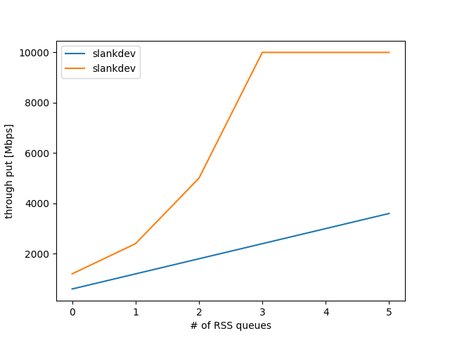

RSSに関する情報調査
===================

ここではRSS(Receive Side Scaling)に関する調査報告を行う.
RSSに関しては, Takuya Asada (syuu1228)氏のブログの記事が参考になるため,
そちらを参考にしてほしい.

- [参考] Takuya Asada, Linuxのネットワークスタックのスケーラビリティについて, http://syuu1228.hatenablog.com/entry/20101210/1291941459
- [参考] Receive-Side Scalingについての調査メモ, http://syuu1228.hatenablog.com/entry/20101219/1292725423

DPDKで高速なVNFを実装する場合, 40GbE以上のパケット転送を行う場合には,
RSSを用いることが定石である. ここでは, その方法とスケーラビリティに
関しての調査結果を示していく. 調査には前述しているXellicoを用いる.

本節では, 前述のTxBufferの値は, 32として固定して行う.
主要なDPDKのサンプルアプリケーションは32bulkで固定しているためであり,
現状この値が, DPDKアプリケーションの最適値であると考えているためである.

本節では, RSSのqueueの数を変化させた時のVNFのスケーラビリティを調べる.
TxBufferの検証と同じく, 検証にはXellico vRouterを用いた.
Xellicoはconfigファイルにより, RSSのコンフィグレーションを行うことが
できるため, 本節もソースコードの編集は行わずに, configとなるJSONファイル
の編集のみをおこなった.

実験方法
---------

固定パラメータ
- Tx Buffer

変動パラメータ
- RSS number of Queues
- packet size

実験結果
--------

- x540の場合, RSSはリニアにスケールする (dummy)
- xl710の場合, RSSはリニアにはスケールしない(dummy) (HW限界)

実験結果のグラフを :numref:`rss_result` に示す.

  RSSの性能計測結果　

考察
----

10GbEレベルでは, RSSは理想的なロードバランス性能を出すことができる.
このため, コアの数さえおおくあれば, あらゆるVNFが10GbEのWirerateを
達成できることになる.

