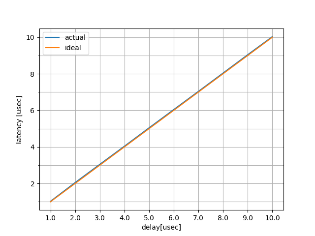
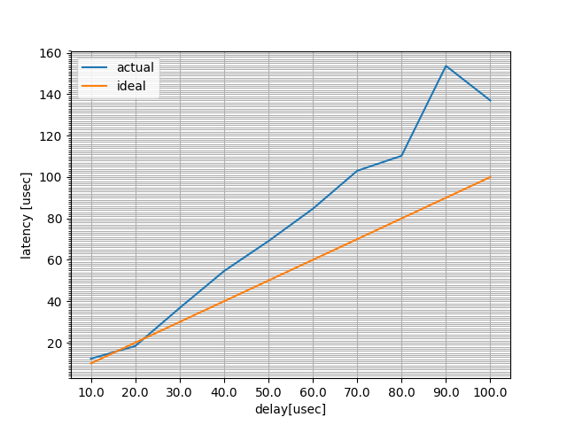

実験準備
========

Delayの実験方法

rte_delay_us_block
-------------------

DPDKには ``rte_delay_ms()`` , ``rte_delay_us_block()`` といったdelayを作り出す
関数が存在している. ``rte_delay_ms()`` は, 内部で ``rte_delay_us_block()`` を
呼び出しているので実質は ``rte_delay_us_block()`` のみである.
``rte_delay_us_block()`` は以下に示す様な実装になっており,
この ``rte_get_timer_cycles()`` は内部でTSC(Time Stamp Clock)を参照する関数な
ため, TSCを用いて計算されている. これらの値が正しいかを確認するために,
念のために「TSCでTSCを評価する試験」を実施した.

- ドキュメント: http://dpdk.org/doc/api/rte__cycles_8h.html

.. code-block:: c

  // rte_delay_us_block関数の実装
  void
  rte_delay_us_block(unsigned int us)
  {
    const uint64_t start = rte_get_timer_cycles();
    const uint64_t ticks = (uint64_t)us * rte_get_timer_hz() / 1E6;
    while ((rte_get_timer_cycles() - start) < ticks)
      rte_pause();
  }

本実験では, ``rte_delay_us_block()`` を :ref:`method` で定義した
内部レイテンシ計測方法を用いて評価する.
``rte_delay_us_block()`` の評価結果を示す.
また, 実験結果のグラフを :numref:`delay_us_latency` に示す.

.. csv-table::
  :header: 設定delay[usec], 遅延結果[clock], 遅延結果[usec], accurecy[%]
  :widths: 5, 5, 5, 5
  :file: img/delay_us_latency.csv

  マイクロ秒遅延

dirty_looped_delay_10ns関数(空ループdelay)
-------------------------------------------

nano secオーダのdelayが欲しかったが, さすがにCPUのクロック周波数が2GHz程度では,
その細かさの正確なdelayは作れなかったので, 10nsオーダのなんとなく正しいdelay
関数を無理やり実装した. この方法は完全なdirty-hackなため推奨されるべきものではない.
以下に実装を示す.  筆者の環境ではなんとかこれでそれっぽい精度で動いている.

.. code-block:: none

  static inline void
  dirty_looped_delay_10ns (uint32_t nsec)
  {
    volatile uint32_t vcount = nsec*8 + nsec;
    while (vcount --);
  }

dirty_looped_delay_10ns関数の評価結果を示す.

.. csv-table::
  :header: 設定delay[nsec], 遅延結果[clock], 遅延結果[usec], accurecy[%]
  :widths: 5, 5, 5, 5
  :file: img/delay_ns_latency.csv

実験結果のグラフを :numref:`delay_ns_latency` に示す.

  ナノ秒遅延

性能評価
---------

delayの検証用プログラムを以下に示す.

- https://github.com/slankdev/xellico/blob/db5bd57f14390cc457a2574626d19a7506256282/misc/delay_eval/main.c

