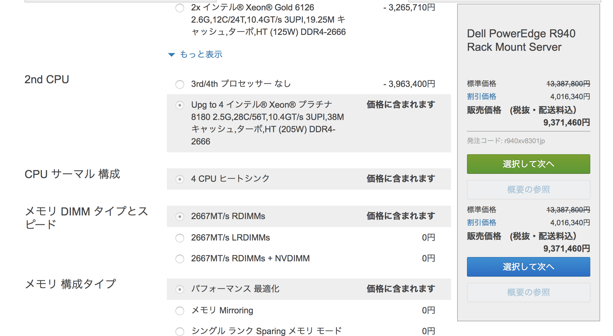

Packet/Secondの計算に関して
===========================

本研究では, 途中計算なしに, パケット処理能力の計算を行うことが多いため,
念のためにここでそれに関する方法を整理しておく.

単位に関して.

.. math::

  1 msec = 1 * 10^{-3} sec \\
  1 usec = 1 * 10^{-6} sec \\
  1 nsec = 1 * 10^{-9} sec \\
  1 GHz  = 1 * 10^{9} clocks/sec \\

64B,10Gbps に関して

.. math::

  10G bit/sec \\
  sizeof(Ethernet Frame) = 64 byte (including FCS) \\
  sizeof(preamble)       = 8  byte \\
  sizeof(InterFrameGap)  = 12 byte \\
  PacketSize = 84 byte = 672 bit \\

  10Gbit = 14.8 Mpacket \\
  64B, 10Gbps = 14.8Mpps \\

64B,10Gbps=14Mpps, 秒に関して

.. math::

  14.8Mpps = 14.8*10^6 packet/sec \\
  14.8*10^6 packet = 1 sec \\
  1 packet = \frac {1} {14.8*10^6} sec \\
  1 packet = 67*10^-9 sec \\
  1 packet = 67 nsec \\

64B,10Gbps=14Mpps, 3GHz-CPUに関して

.. math::

  3GHz = 3*10^9 clock/sec \\
  14.8Mpps = 14.8M packet/sec \\

  14.8*10^6 packet = 3*10^9 clock \\
  1 packet = \frac {3*10^9} {14.8*10^6} clock \\
  1 packet = 202.7 clock

64B,100Gbps=148Mpps, 秒に関して

.. math::

  148Mpps = 148*10^6 packet/sec \\
  148*10^6 packet = 1 sec \\
  1 packet = \frac {1} {148*10^6} sec \\
  1 packet = 6.72*10^-9 sec \\
  1 packet = 6.72 nsec !!!! \\

64B,100Gbps=148Mpps, 3GHz-CPUに関して

.. math::

  3GHz = 3*10^9 clock/sec \\
  148Mpps = 148 * 10^6 packet/sec \\

  148*10^6 packet = 3*10^9 clock \\
  1 packet = \frac {3*10^9} {148*10^6} clock \\
  1 packet = 20 clock !!!!

脇道にそれて少し考察
--------------------

**この部分は最後の考察に移動するかもしれない**

うーん, 実にすごい世界だ.... 100Gをするにはなかなかすごい計算を
しないと行けなさそうである. ちょっとだけ脇道にそれた計算をしよう...

2018年5月1日時点でもっともコア数が多く, 動作周波数もそこそこに
良いCPUである. Xeon SP Platinum 8180 [XEONSPplatinum8180]_
を使って100GNICを幾つかつけた
マシンを作ったと思って計算してみよう.

仮想のマシンスペックは以下のようになる.

.. csv-table::
  :header: 要素, 概要
  :widths: 5, 10

  NIC           , Mellanox Connect-X5 (100GbE) x4
  CPU           , Intel(R) Xeon(R) Platinum 8180 CPU @ 2.50GHz x4
  RAM           , DDR4 64GB
  HyperThreading, Disabled
  TurboBoost    , Enable 3.5GHz (default:2.5GHz)
  # of Cores    , 28 * 4 = 112

このマシンを使って, 100GbE x4の高速PCルータ (要するに400GbEルータ)
を開発する場合の計算速度を見積もってみよう.

まず前提計算としてPPSの計算をする.

64B,400GbpsのPPS計算

.. math::

  400Gbit/sec\\
  PacketSize = 84byte = 672 \\
  400Gbit = 592 \\

64B,400Gbps=592Mpps, 3.5GHz-CPUに関して

.. math::

  592Mpps = 592 * 10^6 packet / sec \\
  3.5GHz = 3.5 * 10^9 clock /sec \\

  592Mpps = 3.5Ghz \\
  592 * 10^6 packet = 3.5 * 10^9 clock \\
  1 packet = frac {3.5 * 10^9} {592 * 10^6} clock \\
  1 packet = 5.9 clock !! \\

コア数が112個あるので, RSSで完全並列にしたとして,

.. math::

  5.9 clock/packet, 1 cores \\
  660.8 clock/packet, 112 cores \\

うーん.. 帯域レベルを満足させるのなら, なんとかできそう..?
ちなみにこの構成でDEELのマシンを組んでみると以下のような見積もり値段である.
見積もり結果を :numref:`xeonplatinum` に示す.

  400GbE高速PCルータの計算機

900万円で400GルータのHWが揃うとおもうと, 安い.となるか. 高いとなるかは
みなさま次第だ.

