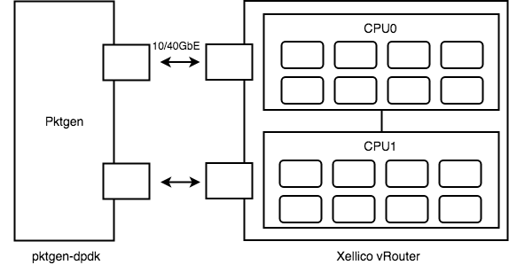

計算機環境
-----------

本研究の性能計測は,2台のXeonサーバを用いて行なった, 片方でDUTとして
Xellicoを動作させ, 他方では通信性能計測のためにpktgen-dpdkを動作させた.
性能は帯域と遅延に関して行う.  また, 性能計測結果の正確な考察を行うために,
TimeStampClockを用いてDPDKの関数のマイクロレイテンシを計測した.

本研究で用いた計算機環境を示す.
計算機は, DUT, TrafficGenerator/Anlyzerの計2台の計算機を用いた.
片方のサーバ(DUT)でXellicoを動作させ, 他方のサーバで
pktgen-dpdkを動作させた.

実験に使用した計算機2台のスペックを以下に示す.
まずDUTに使用した計算機のスペックを以下に示す.

.. csv-table::
  :header: 要素, 概要
  :widths: 5, 10

  OS            , Ubuntu 16.04.4 LTS
  Linux Kernel  , 4.4.0-116-generic
  DPDK          , 17.11 (forked from dpdk.org)
  NIC           , Intel X540-AT2 (10GbE)
  CPU           , Intel(R) Xeon(R) Silver 4108 CPU @ 1.80GHz x2
  RAM           , DDR4 32GB
  HyperThreading, Disabled

次にTesterに使用した計算機のスペックを以下に示す.

.. csv-table::
  :header: 要素, 概要
  :widths: 5, 10

  OS            , Ubuntu 16.04.3 LTS
  Linux Kernel  , 4.4.0-87-generic
  DPDK          , 17.11 (forked from dpdk.org)
  NIC           , Intel X540-AT2 (10GbE)
  CPU           , Intel(R) Xeon(R) CPU E5-2667 v3 @ 3.20GHz x2
  RAM           , 種類不明 64GB
  HyperThreading, Disabled

性能計測時は以下に示す通りに接続して検証をおこなった.

	実験環境の物理ネットワーク

