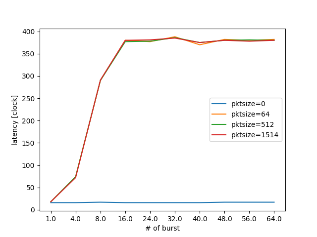
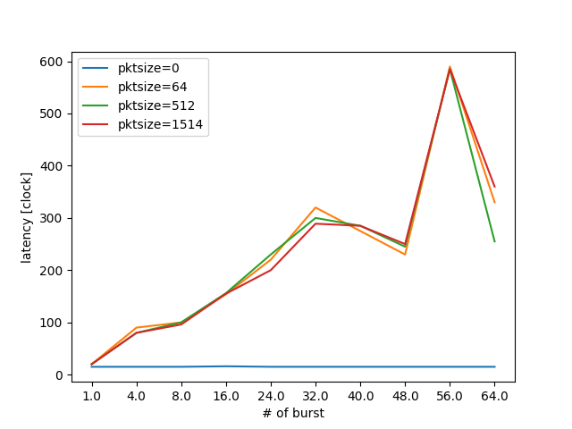

基本実験
========

送受信関数の実験結果

以下に, burstサイズを変化させた時のDPDKのパケットの送受信関数の遅延を示す.
まずはrxburstとtxburstの結果を示す.

以下にrxburstの遅延結果を表で示す.

rxburst
-------

.. csv-table::
  :header: #burst, rx(none), rx(64byte), rx(512byte), rx(1514byte)
  :widths: 1, 1, 1, 1, 1
  :file: img/dpdk_rxburst_delay.csv

上記の内容を図として示す.

  rte_eth_rx_burstの遅延

txbuffer_flush
---------------

.. csv-table::
  :header: #burst, tx(none), tx(64byte), tx(512byte), tx(1514byte)
  :widths: 1, 1, 1, 1, 1
  :file: img/dpdk_txbufferflush_delay.csv

上記の値は計測中にある程度ばらつきがあった.
上記の内容を図として示す. rxburstのサイズは32で固定値として実験をした.
txburstを32より多くすることで性能が変わらないとしたら, rxburstsize=32
が原因であると考えられる.

  rte_eth_tx_burstの遅延

txbuffer
--------

次にtxbufferの結果を示す.
txbufferはshotでしか送ることができない.

.. csv-table::
  :header: pktsize, latency
  :widths: 1, 1
  :file: img/dpdk_txbuffer_delay.csv

TxBufferの実験結果
------------------

これらの関数の呼び出しにどの程度の遅延が生じているかを明らかにすることは,
正しいベンチマーク結果の考察に必要である.
以下のようなサンプルコードを記述し, 計測を行なった.

ここではTxBufferに関する情報調査と, 性能計測結果に関して報告を行う.
TxBufferとは, NICで特定のバルクサイズに達するまで,パケットを送信せず
バッファリングしておき, バルクサイズに合わせてTxの処理を行うための
DPDKのAPIの一つである. PCIeのNICのTxの処理は計算量的に高コストである
ため, 10GbE以上のトラフィックに対して1パケットずつ送信処理を行うと
高性能化が行えなので, それを解決するための機構である.

実験結果のグラフを
:numref:`txbuffer_throughput_bps` ,
:numref:`txbuffer_throughput_pps` ,
:numref:`txbuffer_latency` に示す.

まずbpsについて

.. csv-table::
  :file: img/txbuffer_throughput_bps.csv

.. figure:: img/txbuffer_throughput_bps.png
  :name: txbuffer_throughput_bps

  txbufferの性能計測結果bps(帯域)

次にppsについて

.. csv-table::
  :file: img/txbuffer_throughput_pps.csv

.. figure:: img/txbuffer_throughput_pps.png
  :name: txbuffer_throughput_pps

  txbufferの性能計測結果pps(帯域)

そしてlatency

.. figure:: img/txbuffer_latency.png
  :name: txbuffer_latency

  txbufferの性能計測結果(遅延)

