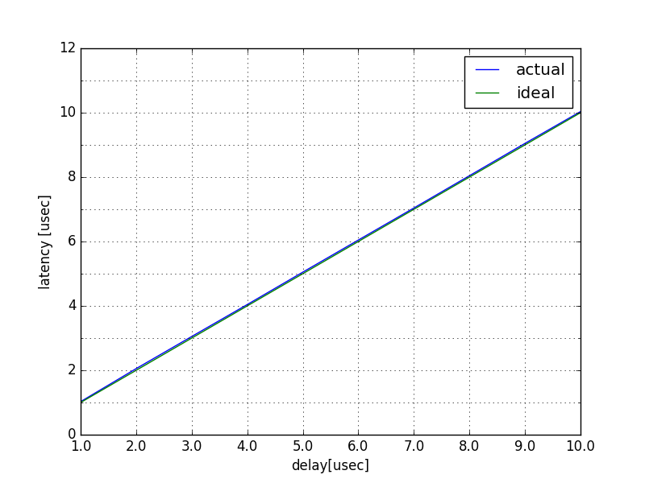
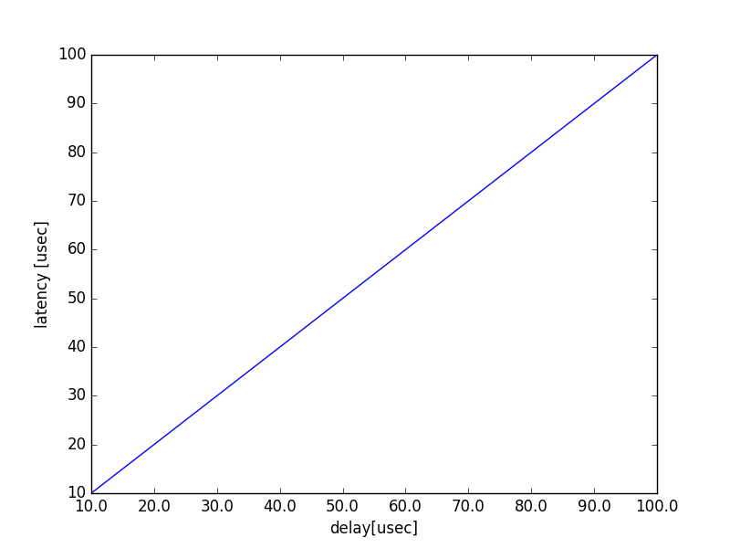

Delayの実験結果
=================

rte_delay_us_block
-------------------------

rte_delay_us_block関数の評価結果を示す.

.. csv-table::
  :header: 設定delay[usec], 遅延結果[clock], 遅延結果[usec], accurecy[%]
  :widths: 5, 5, 5, 5
  :file: img/delay_us_latency.csv

実験結果のグラフを :numref:`delay_us_latency` に示す.

  マイクロ秒遅延

dirty_looped_delay_10ns
-------------------------

dirty_looped_delay_10ns関数の評価結果を示す.

.. csv-table::
  :header: 設定delay[nsec], 遅延結果[clock], 遅延結果[usec], accurecy[%]
  :widths: 5, 5, 5, 5
  :file: img/delay_ns_latency.csv

実験結果のグラフを :numref:`delay_ns_latency` に示す.

  ナノ秒遅延

