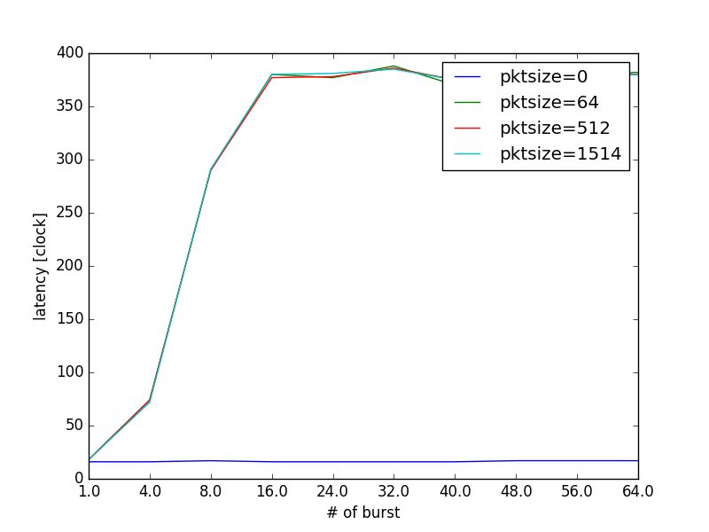
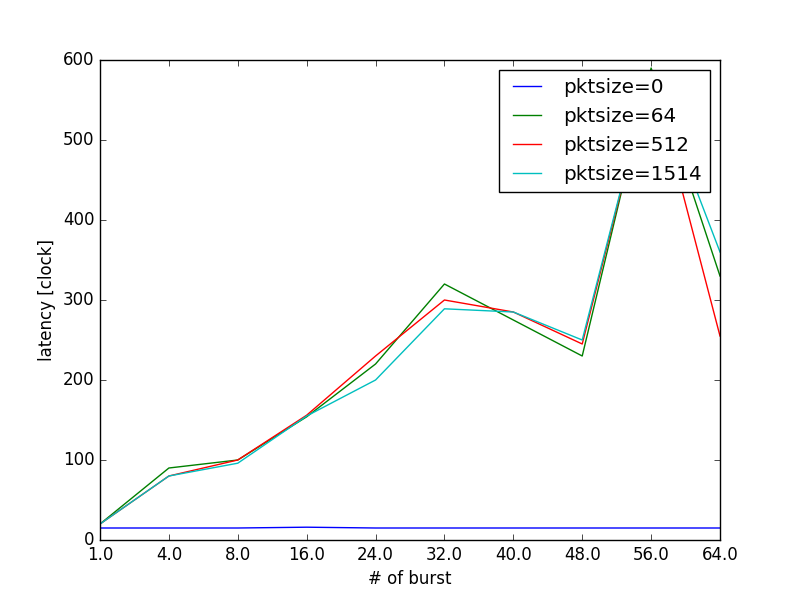
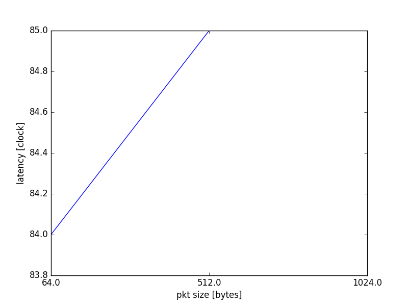

送受信関数の実験結果
====================

以下のデータはまだdummy値である.

以下に, burstサイズを変化させた時のDPDKのパケットの送受信関数の遅延を示す.
まずはrxburstとtxburstの結果を示す.

以下にrxburstの遅延結果を表で示す.

rxburst
-------

.. csv-table::
  :header: #burst, rx(none), rx(64byte), rx(512byte), rx(1514byte)
  :widths: 1, 1, 1, 1, 1
  :file: img/rxburst_delay.csv

上記の内容を図として示す.

  rte_eth_rx_burstの遅延

txburst
-------

.. csv-table::
  :header: #burst, tx(none), tx(64byte), tx(512byte), tx(1514byte)
  :widths: 1, 1, 1, 1, 1
  :file: img/txburst_delay.csv

上記の内容を図として示す.

  rte_eth_tx_burstの遅延

txbuffer
--------

次にtxbufferの結果を示す.
txbufferはshotでしか送ることができない.

.. csv-table::
  :header: pktsize, latency
  :widths: 1, 1
  :file: img/txbuffer_delay.csv

  txburstの遅延
