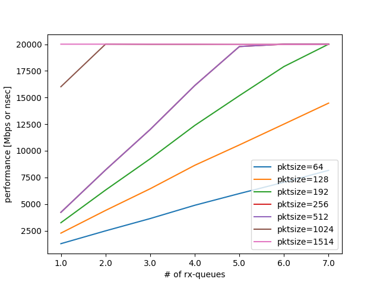
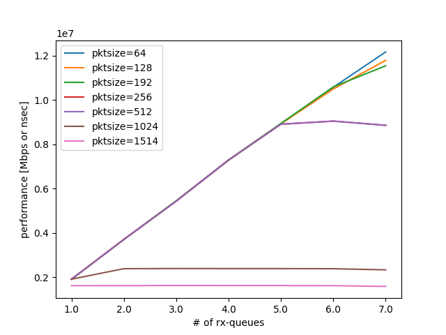
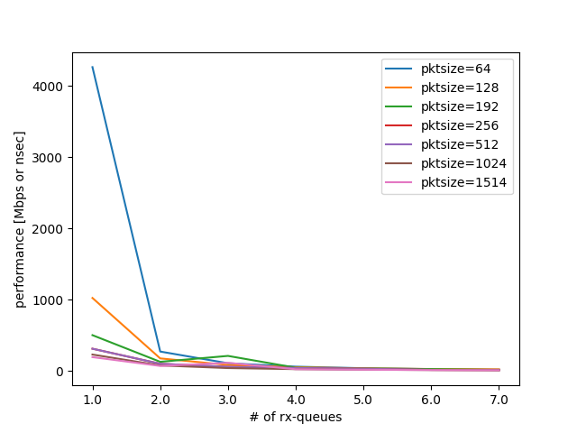

RSSの実験結果
-------------

- x540の場合, RSSはリニアにスケールする (dummy)
- xl710の場合, RSSはリニアにはスケールしない(dummy) (HW限界)

実験結果のグラフを
:numref:`rss_throughput_bps` ,
:numref:`rss_throughput_pps` ,
:numref:`rss_latency` に示す.

  RSSの性能計測結果(帯域) bps

  RSSの性能計測結果(帯域) pps

  RSSの性能計測結果(遅延)

