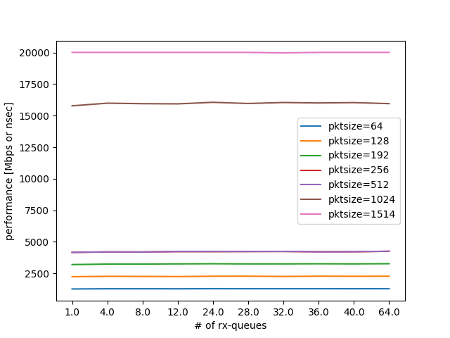
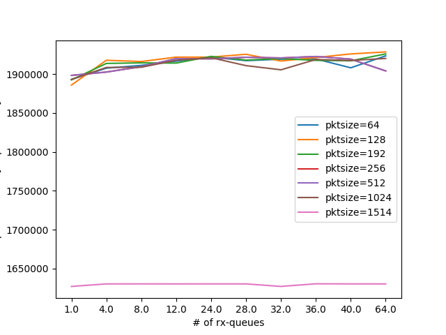
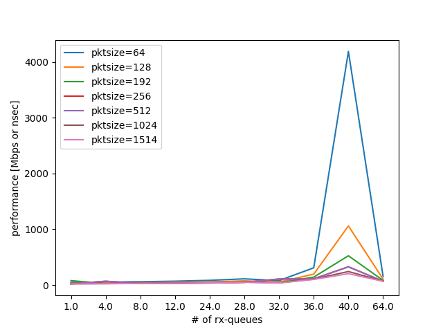

TxBufferの実験結果
------------------

これらの関数の呼び出しにどの程度の遅延が生じているかを明らかにすることは,
正しいベンチマーク結果の考察に必要である.
以下のようなサンプルコードを記述し, 計測を行なった.

ここではTxBufferに関する情報調査と, 性能計測結果に関して報告を行う.
TxBufferとは, NICで特定のバルクサイズに達するまで,パケットを送信せず
バッファリングしておき, バルクサイズに合わせてTxの処理を行うための
DPDKのAPIの一つである. PCIeのNICのTxの処理は計算量的に高コストである
ため, 10GbE以上のトラフィックに対して1パケットずつ送信処理を行うと
高性能化が行えなので, それを解決するための機構である.

実験結果のグラフを
:numref:`txbuffer_throughput_bps` ,
:numref:`txbuffer_throughput_pps` ,
:numref:`txbuffer_latency` に示す.

まずbpsについて

.. csv-table::
  :file: img/txbuffer_throughput_bps.csv

  txbufferの性能計測結果bps(帯域)

次にppsについて

.. csv-table::
  :file: img/txbuffer_throughput_pps.csv

  txbufferの性能計測結果pps(帯域)

そしてlatency

  txbufferの性能計測結果(遅延)

